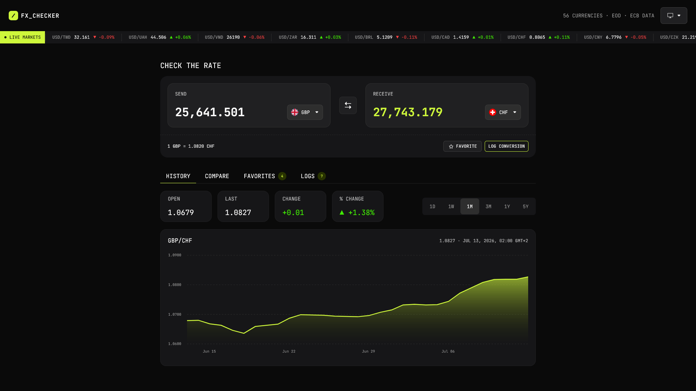

# Frontend Mentor - FX Checker solution

[](https://wakatime.com/@MaelkMark)


This is a solution to the [FX Checker challenge on Frontend Mentor](https://www.frontendmentor.io/challenges/foreign-exchange-currency-converter). Frontend Mentor challenges help you improve your coding skills by building realistic projects. 

## Table of contents

- [Table of contents](#table-of-contents)
- [Overview](#overview)
  - [The challenge](#the-challenge)
    - [Converter](#converter)
    - [Currency picker](#currency-picker)
    - [Live markets ticker](#live-markets-ticker)
    - [Rate history](#rate-history)
    - [Compare](#compare)
    - [Favorites](#favorites)
    - [Conversion log](#conversion-log)
    - [UI \& accessibility](#ui--accessibility)
  - [Screenshot](#screenshot)
  - [Links](#links)
  - [Extra features](#extra-features)
- [My process](#my-process)
  - [Built with](#built-with)
  - [Building process](#building-process)
  - [Project structure](#project-structure)
  - [Useful resources](#useful-resources)
  - [AI Collaboration](#ai-collaboration)
- [Author](#author)

## Overview

### The challenge

Your users should be able to:

#### Converter

- Enter an amount to send and see it convert in real time as they type
- Pick the "send" and "receive" currencies from a searchable currency picker
- See the live exchange rate for the active pair (for example, `1 USD = 0.8530 EUR`)
- Swap the send and receive currencies with the swap button
- Favorite the active pair, and log a conversion to their history

#### Currency picker

- Search the full list of available currencies by code or name
- See currencies grouped into "Popular" and "Other currencies", each row showing the flag, code, and name
- See a check against the currency that's currently selected

#### Live markets ticker

- See a ticker of currency pairs, each with its current rate and 24-hour change (up or down)

#### Rate history

- View a line and area chart of the active pair's rate over time
- Switch the chart range between 1D, 1W, 1M, 3M, 1Y, and 5Y
- See the open, last, absolute change, and percentage change for the selected range

#### Compare

- See their send amount converted into a range of other currencies at once, each with its reference rate
- Pin or unpin any comparison row to their favorites

#### Favorites

- See their pinned pairs, each with its live rate and 24-hour change
- Load a pinned pair back into the converter by selecting its row
- Unpin a pair they no longer want to track

#### Conversion log

- See a log of conversions they've made, each showing the relative time, the pair, and the send and receive amounts
- Clear the whole log
- Delete an individual entry

#### UI & accessibility

- View the optimal layout for the interface depending on their device's screen size
- See hover and focus states for all interactive elements on the page
- Navigate the entire app using only their keyboard

### Screenshot



### Links

- *Frontend Mentor Solution page (coming soon, I just haven't submitted it yet)*
- [Source code](https://github.com/MaelkMark/foreign-exchange-checker)
- [Live site](https://maelkmark.github.io/frontendmentor/foreign-exchange-checker/)

### Extra features

- Detect the user's location and set the default "receive" currency to their local currency. It also displays the local currency in the "Popular" section of the currency picker.
- Loading animations for the converter, currency picker, and live markets ticker.
- Error handling for API requests, with user-friendly error messages.
- The "send" and "receive" currencies are stored in the URL as search parameters, so the user can share the link and the recipient will see the same currencies. If the specified currencies are invalid, the app will fall back to the default currencies.
- The history chart features a tooltip that displays the exact rate at the hovered point, as well as the date and time of that point. The tooltip is accessible via keyboard navigation (arrow keys) as well.
- Light and dark theme support, with a toggle button to switch between them. The user's theme preference is stored in local storage. The default theme is based on the user's system preference, using the `color-scheme: light dark` CSS property.

## My process

### Built with

- Modern vanilla CSS
- [React](https://reactjs.org/) (JS library)
- [React Aria](https://react-aria.adobe.com/) (React components)
- [ApexCharts](https://apexcharts.com/) (Charting library)
- [TanStack Query](https://tanstack.com/query/latest) (Data fetching)
- [Frankfurter API](https://www.frankfurter.dev/) (Currency exchange rates API)
- *[Free IP API](https://freeipapi.com/) (IP geolocation API for currency detection)*
- [pnpm](https://pnpm.io/) (package manager)
- [Vite](https://vitejs.dev/) (build tool)

### Building process

I started by building the reusable components, such as the currency picker, the live markets ticker, and the conversion log. Then I planned the basic building blocks of the app, such as the header, converter, and the tabs for the different sections. After that, I implemented the data fetching and state management using React Query. Then, I begun implementing the individual layout components, starting with the header, followed by the converter and tabs. Finally, I added the extra features, such as the location detection, loading animations, and theme toggle.

### Project structure

The root of the project contains the Frontend Mentor related files, such as the README. The source code is located in the `app/src` folder, which contains the following structure:

```
app/src/
├── assets/          Flags, icons, and fonts
├── components/      Reusable components
├── hooks/           Custom hooks
├── context/         React context providers
├── utils/           Utility functions
├── layouts/         Layout components
└── App.jsx          Main app component
```

### Useful resources

- [React Aria Docs](https://react-aria.adobe.com/) - I used the React Aria docs to find the right components and to look up how to use them. The StackBlitz examples were especially helpful for understanding how to implement them.
- [Frankfurter API Docs](https://www.frankfurter.dev/) - I used the Frankfurter API docs to understand how to fetch exchange rates and historical data.

### AI Collaboration

- GitHub Copilot for inline code suggestions and generating boilerplate code
- Gemini for brainstorming

## Author

Hi, my name is Márk Magyar, you can find me as MaelkMark everywhere on the internet:

- Website - [MaelkMark](https://maelkmark.github.io)
- GitHub - [@MaelkMark](https://github.com/MaelkMark)
- Frontend Mentor - [@MaelkMark](https://www.frontendmentor.io/profile/MaelkMark)